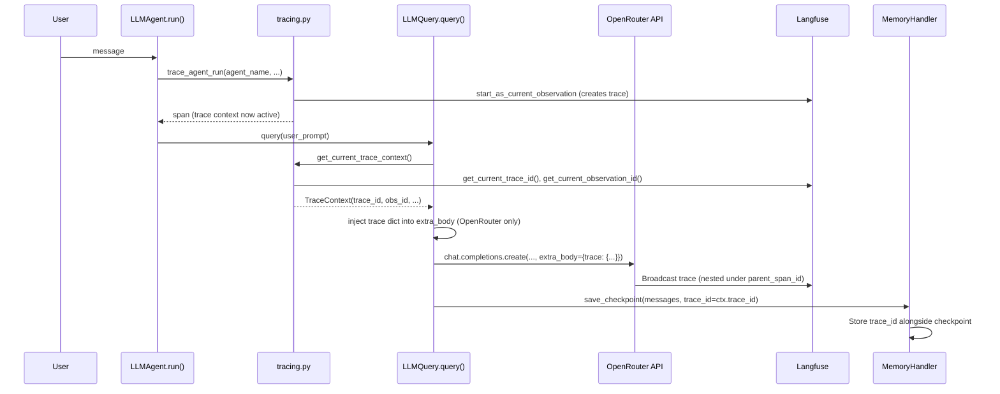

# Synchronize IDs: Langfuse ↔ OpenRouter Broadcast ↔ Memory

## Goal

Establish a **single source of truth** for all observability and conversation IDs so that the same identifiers flow through:

1. **Langfuse** tracing (`ai_tools/tracing.py`)
2. **OpenRouter** Broadcast API (`ai_tools/tools.py` — `extra_body.trace`)
3. **Memory** checkpoints (`ai_tools/memory/`)

This enables end-to-end correlation: a Langfuse trace links directly to the OpenRouter generation that produced it, and the memory checkpoint that persisted it.

---

## Problem Analysis

### Current State

| System | ID Source | Status |
|---|---|---|
| Langfuse | SDK auto-generates `trace_id` / `observation_id` internally | ✅ Working, but IDs are opaque |
| OpenRouter | No `trace` dict sent → Broadcast creates **disconnected** top-level traces in Langfuse | ❌ Broken |
| Memory | `thread_id` / `step_id` only — no `trace_id` correlation | ❌ Missing |

### Target State

| System | ID Source | Result |
|---|---|---|
| Langfuse | SDK still manages trace context; we **read** IDs via `get_current_trace_id()` / `get_current_observation_id()` | ✅ Same as before |
| OpenRouter | `extra_body.trace` carries `trace_id`, `parent_span_id`, `session_id`, `user_id`, `environment`, `trace_name`, `generation_name` → Broadcast nests under existing Langfuse hierarchy | ✅ Linked |
| Memory | Checkpoint stores `trace_id` for audit trail | ✅ Correlated |

---

## Relevant Documentation

- [OpenRouter Broadcast Overview](https://openrouter.ai/docs/guides/features/broadcast/overview)
- [OpenRouter → Langfuse Broadcast](https://openrouter.ai/docs/guides/features/broadcast/langfuse)
- [Langfuse Trace IDs & Distributed Tracing](https://langfuse.com/docs/observability/features/trace-ids-and-distributed-tracing)

---

## ID Taxonomy

| ID | Scope | Where Generated | Where Consumed |
|---|---|---|---|
| `trace_id` | One user turn (prompt → final answer) | Langfuse SDK (auto) → read via `get_current_trace_id()` | Langfuse, OpenRouter `trace.trace_id`, Memory checkpoint |
| `observation_id` (= `parent_span_id` for OpenRouter) | Current span/generation within the trace | Langfuse SDK (auto) → read via `get_current_observation_id()` | OpenRouter `trace.parent_span_id` |
| `session_id` | Conversation thread (multiple turns) | `MemoryHandler.root_thread_id` (already exists) | Langfuse, OpenRouter `session_id` |
| `user_id` | End-user identity | Passed in at agent/query level (already exists) | Langfuse, OpenRouter `user`, Memory |
| `trace_name` | Human-readable label for the root trace | Derived: `{agent_name}` or `"LLMQuery"` | Langfuse, OpenRouter `trace.trace_name` |
| `generation_name` | Human-readable label for a single LLM call | Derived: `"generation:{agent_name}:{model}"` | OpenRouter `trace.generation_name`, Langfuse (via `name` param) |
| `span_name` | Human-readable label for a grouping span | Derived from `trace_agent_run` name | OpenRouter `trace.span_name` |
| `environment` | Deployment stage | `os.getenv("ENVIRONMENT", "development")` | Langfuse metadata, OpenRouter `trace.environment` |

---

## Architecture

### ID Flow Diagram



### Key Design Principle: Read, Don't Generate

> [!IMPORTANT]
> We do **NOT** generate trace/observation IDs independently. The Langfuse SDK manages context propagation via `contextvars`. We simply **read** the current `trace_id` and `observation_id` from the Langfuse client at the point of the OpenRouter API call and pass them through.
>
> This avoids ID mismatch and ensures the Broadcast trace always nests correctly under the Langfuse-managed hierarchy.

### When Tracing Is Disabled

When `is_tracing_enabled()` returns `False`:
- `get_current_trace_context()` returns `None`
- No `trace` dict is injected into `extra_body` (OpenRouter still works, just without broadcast linking)
- Memory checkpoint stores `trace_id = None`
- Zero behavioral impact — pure no-op

---

## Proposed Changes

### Component 1: Tracing Module

#### [MODIFY] [tracing.py](file:///home/martin/Python/Projects/Github/pokemon-llm/ai_tools/tracing.py)

**1a. Add `TraceContext` dataclass**

A lightweight, frozen data carrier holding all resolved IDs for the current execution scope:

```python
import os
from dataclasses import dataclass

@dataclass(frozen=True)
class TraceContext:
    """Resolved trace identifiers for the current execution scope."""
    trace_id: Optional[str]
    observation_id: Optional[str]
    session_id: Optional[str]
    user_id: Optional[str]
    trace_name: Optional[str]
    environment: str
```

**1b. Add `get_current_trace_context()` function**

Reads the active Langfuse context and packages it into a `TraceContext`:

```python
def get_current_trace_context(
    *,
    session_id: Optional[str] = None,
    user_id: Optional[str] = None,
    trace_name: Optional[str] = None,
) -> Optional[TraceContext]:
    """Read current Langfuse trace/observation IDs and return a TraceContext.

    Returns None if tracing is disabled or no Langfuse context is active.
    """
    if not is_tracing_enabled():
        return None

    client = get_langfuse_client()
    if not client:
        return None

    trace_id = client.get_current_trace_id()
    observation_id = client.get_current_observation_id()

    if not trace_id:
        return None

    return TraceContext(
        trace_id=trace_id,
        observation_id=observation_id,
        session_id=session_id,
        user_id=user_id,
        trace_name=trace_name,
        environment=os.getenv("ENVIRONMENT", "development"),
    )
```

**1c. Add `build_openrouter_trace_dict()` helper**

Converts a `TraceContext` into the dict expected by OpenRouter's `extra_body.trace`:

```python
def build_openrouter_trace_dict(
    ctx: Optional[TraceContext],
    *,
    generation_name: Optional[str] = None,
    span_name: Optional[str] = None,
) -> Optional[Dict[str, Any]]:
    """Build the OpenRouter trace dict from a TraceContext.

    Returns None if ctx is None (tracing disabled).
    """
    if ctx is None:
        return None

    trace = {
        "trace_id": ctx.trace_id,
        "environment": ctx.environment,
    }

    if ctx.observation_id:
        trace["parent_span_id"] = ctx.observation_id
    if ctx.session_id:
        trace["session_id"] = ctx.session_id
    if ctx.user_id:
        trace["user_id"] = ctx.user_id
    if ctx.trace_name:
        trace["trace_name"] = ctx.trace_name
    if generation_name:
        trace["generation_name"] = generation_name
    if span_name:
        trace["span_name"] = span_name

    return trace
```

---

### Component 2: LLMQuery (OpenRouter Integration)

#### [MODIFY] [tools.py](file:///home/martin/Python/Projects/Github/pokemon-llm/ai_tools/tools.py)

**2a. Update `_prepare_request_kwargs()` — centralize OpenRouter and User payload injection**

Update the method signature to accept `openrouter_trace` and `user_id`, and place all request manipulation logic inside it.

```python
    def _prepare_request_kwargs(
        self,
        messages: List[Dict[str, str]],
        stream: bool,
        json_format: bool,
        model: Optional[str] = None,
        reasoning_effort: Optional[str] = None,
        tools: Optional[List[Dict]] = None,
        tool_choice: Optional[Union[str, Dict]] = None,
        openrouter_trace: Optional[Dict] = None, # NEW
        user_id: Optional[str] = None,           # NEW
        **kwargs,
    ) -> Dict:
        # ... standard request_kwargs setup ...
        
        request_kwargs.update(kwargs)

        if user_id:
            request_kwargs["user"] = user_id

        if target_model.startswith("openrouter/"):
            extra_body = request_kwargs.setdefault("extra_body", {})
            provider = extra_body.setdefault("provider", {})
            provider.setdefault("require_parameters", True)
            provider.setdefault("data_collection", "deny")
            extra_body["usage"] = {"include": True}
            
            if openrouter_trace:
                extra_body["trace"] = openrouter_trace

        return request_kwargs
```

**2b. Update `query()` — orchestrate trace resolution and payload building**

Reorder the workflow in `query()` to resolve the `session_id` and Langfuse trace context *first*, then pass the fully formed `trace_dict` and `user_id` directly into `_prepare_request_kwargs`.

```python
        # 1. Resolve Session & Metadata
        session_id = None
        if self.memory and hasattr(self.memory, "root_thread_id"):
            session_id = self.memory.root_thread_id

        metadata = {
            "provider": cfg["model"].split("/")[0] if "/" in cfg["model"] else "unknown"
        }
        if cfg["tool_choice"]:
            metadata["tool_choice"] = cfg["tool_choice"]

        # 2. Resolve Tracing
        from .tracing import get_langfuse_params, get_current_trace_context, build_openrouter_trace_dict
        
        langfuse_params = get_langfuse_params(
            model=cfg["model"],
            agent_name=self.agent_name,
            metadata=metadata,
        )
        ctx = get_current_trace_context(
            session_id=session_id,
            user_id=self.user_id,
            trace_name=self.agent_name or "LLMQuery",
        )
        trace_dict = build_openrouter_trace_dict(
            ctx,
            generation_name=langfuse_params.get("name"),
        )

        # 3. Build API Payload
        request_kwargs = self._prepare_request_kwargs(
            messages,
            stream=False,
            json_format=cfg["json_format"],
            model=cfg["model"],
            reasoning_effort=cfg["reasoning_effort"],
            tools=cfg["tools"],
            tool_choice=cfg["tool_choice"],
            openrouter_trace=trace_dict,
            user_id=self.user_id,
            **kwargs,
        )

        from .tracing import propagate_langfuse_attributes

        # 4. Execute
        with propagate_langfuse_attributes(
            user_id=self.user_id,
            session_id=session_id,
        ):
            response = self._create_chat_completion(
                client, **{**request_kwargs, **langfuse_params}
            )
```

**2c. Update `query()` — pass `trace_id` to memory checkpoint**

In the existing checkpoint saving block (around line 1101):

```python
if self.memory and not self.tool_calls:
    usage_snapshot = { ... }
    self.memory.save_checkpoint(
        messages=self.chat_history,
        tool_calls=None,
        usage=usage_snapshot,
        trace_id=ctx.trace_id if ctx else None,   # NEW
    )
```

---

### Component 3: Memory Subsystem

#### [MODIFY] [types.py](file:///home/martin/Python/Projects/Github/pokemon-llm/ai_tools/memory/types.py)

Add `trace_id` field to `ConversationState`:

```python
@dataclass
class ConversationState:
    messages: List[Dict[str, Any]]
    tool_calls: List[Dict[str, Any]] = field(default_factory=list)
    usage: Optional[Dict[str, Any]] = None
    trace_id: Optional[str] = None  # NEW: Langfuse trace correlation
```

#### [MODIFY] [models.py](file:///home/martin/Python/Projects/Github/pokemon-llm/ai_tools/memory/models.py)

Add `trace_id` column to `CheckpointModel`:

```python
class CheckpointModel(Base):
    __tablename__ = "checkpoints"

    id = Column(Integer, primary_key=True, autoincrement=True)
    thread_id = Column(String, ForeignKey(...), nullable=False)
    step_id = Column(Integer, nullable=False)
    messages = Column(JSON, nullable=False)
    tool_calls = Column(JSON, nullable=True)
    usage = Column(JSON, nullable=True)
    trace_id = Column(String, nullable=True)  # NEW
    created_at = Column(DateTime(timezone=True), ...)
```

> [!IMPORTANT]
> **Migration**: Since this is a nullable column addition, SQLAlchemy's `create_all()` won't auto-add it to existing databases. We handle this with a lightweight `ALTER TABLE` in `SQLiteBackend.__init__()` wrapped in try/except — safe, idempotent, no external tooling required.

#### [MODIFY] [handler.py](file:///home/martin/Python/Projects/Github/pokemon-llm/ai_tools/memory/handler.py)

Update `save_checkpoint()` to accept and pass through `trace_id`:

```python
def save_checkpoint(
    self,
    messages: List[Dict[str, Any]],
    tool_calls: Optional[List[Dict[str, Any]]] = None,
    usage: Optional[Dict[str, Any]] = None,
    trace_id: Optional[str] = None,  # NEW
) -> int:
    self._step_id += 1
    state = ConversationState(
        messages=list(messages),
        tool_calls=tool_calls or [],
        usage=usage,
        trace_id=trace_id,  # NEW
    )
    self._backend.save_checkpoint(...)
```

#### [MODIFY] [sqlite.py](file:///home/martin/Python/Projects/Github/pokemon-llm/ai_tools/memory/sqlite.py)

1. Add startup migration in `__init__()`:
```python
def _ensure_schema_up_to_date(self):
    """Add columns introduced after initial schema creation."""
    with self._session_scope() as session:
        try:
            session.execute(text(
                "ALTER TABLE checkpoints ADD COLUMN trace_id TEXT"
            ))
            session.commit()
        except Exception:
            session.rollback()  # Column already exists
```

2. Update `save_checkpoint()` to persist `trace_id` from `ConversationState.trace_id`.

#### [MODIFY] [in_memory.py](file:///home/martin/Python/Projects/Github/pokemon-llm/ai_tools/memory/in_memory.py)

No changes needed — `InMemoryBackend` stores `ConversationState` as-is, so the new `trace_id` field is automatically included.

---

### Component 4: Agent

#### [MODIFY] [agent.py](file:///home/martin/Python/Projects/Github/pokemon-llm/ai_tools/agent.py)

No changes needed. The `LLMAgent.run()` already wraps execution in `trace_agent_run()`, which starts the Langfuse trace. The `LLMQuery.query()` method (modified above) will automatically read the active trace context within that scope.

---

## Summary of All File Changes

| File | Change Type | Description |
|---|---|---|
| `ai_tools/tracing.py` | Add | `TraceContext` dataclass, `get_current_trace_context()`, `build_openrouter_trace_dict()` |
| `ai_tools/tools.py` | Modify | Inject OpenRouter `trace` dict and `user` field, pass `trace_id` to memory |
| `ai_tools/memory/types.py` | Modify | Add `trace_id` to `ConversationState` |
| `ai_tools/memory/models.py` | Modify | Add `trace_id` column to `CheckpointModel` |
| `ai_tools/memory/handler.py` | Modify | Accept `trace_id` in `save_checkpoint()` |
| `ai_tools/memory/sqlite.py` | Modify | Startup migration, persist `trace_id` |
| `ai_tools/memory/in_memory.py` | None | Automatic via `ConversationState` |
| `ai_tools/agent.py` | None | Already wraps in `trace_agent_run()` |
| `ai_tools/tests/test_tracing.py` | Add | Tests for ID sync, trace dict building |

---

## Verification Plan

### Unit Tests

```bash
uv run pytest ai_tools/tests/test_tracing.py -v
```

New test cases:
- `test_get_current_trace_context_disabled` — returns `None` when tracing off
- `test_get_current_trace_context_no_active_trace` — returns `None` when no trace active
- `test_build_openrouter_trace_dict_complete` — all fields populated correctly
- `test_build_openrouter_trace_dict_none_context` — returns `None`
- `test_trace_dict_injected_for_openrouter` — mock OpenRouter call includes `extra_body.trace`
- `test_trace_dict_not_injected_for_gemini` — non-OpenRouter models unaffected
- `test_checkpoint_stores_trace_id` — memory checkpoint persists `trace_id`
- `test_sqlite_migration_idempotent` — `ALTER TABLE` runs safely when column exists

### Manual Verification

1. Run `PokemonAgent` with Langfuse env vars and an OpenRouter model
2. Check Langfuse UI: OpenRouter broadcast traces should nest under the agent's trace hierarchy
3. Check memory DB: `SELECT trace_id FROM checkpoints` should show Langfuse trace IDs
